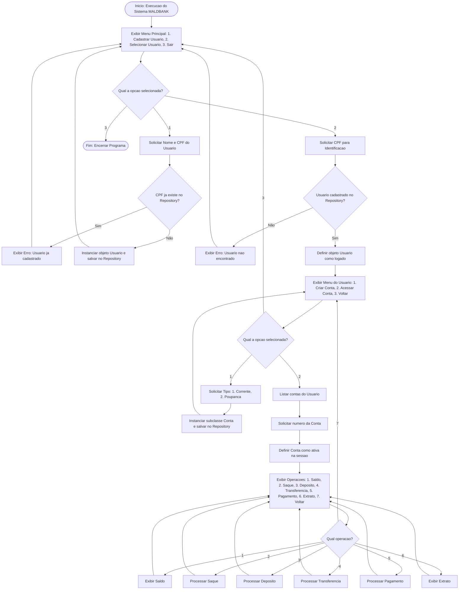

# MALDBANK

Criação do MALDBANK como projeto final da matéria de engenharia de Software

Sobre o Projeto
O MALDBANK é um sistema de simulação bancária que permite o gerenciamento de usuários e suas contas, oferecendo operações financeiras com suporte a diferentes tipos de conta (EX: Corrente e Poupança).

Principais Funcionalidades
Gestão de Usuários: Cadastro e autenticação via terminal.

Gestão de Contas: Abertura de contas com tipos distintos e polimórficos.

Operações Financeiras: Consultar saldo, Saque, Depósito, Transferência e Pagamento.

Histórico: Emissão de extrato de movimentações.

Arquitetura do Sistema
O sistema foi desenhado para manter o baixo acoplamento e alta coesão, utilizando um padrão de repositório em memória para a persistência temporária dos dados durante a execução da sessão.
## Fluxograma do Sistema


## Tecnologias e Metodologias

| Categoria | Tecnologias / Práticas |
| :--- | :--- |
| **Linguagem** | Java |
| **Metodologias** | Scrum, Kanban, XP |
| **Testes** | JUnit 5, Mockito |
| **Documentação** | Mermaid.js |

---

## Como Executar

Para rodar o projeto localmente, siga os passos abaixo:

1. **Clonar o repositório:**
   ```bash
   git clone [https://github.com/daviiq/MALDBANK](https://github.com/daviiq/MALDBANK)
   ```
   Pré-requisitos: Certifique-se de ter o JDK 17 ou superior instalado em sua máquina.

## Equipe de Desenvolvimento

Este projeto é um esforço colaborativo dos seguintes membros:

* **Adriel Alves Ferreira**
* **Davi Israel Quirino**
* **Marcos Júnior Lemes**
* **Lucas Luiz Guesser**

**Colaborador **
* *Monica Cancellier* 
