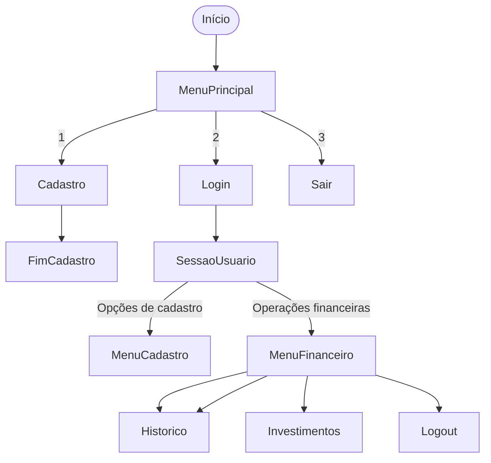
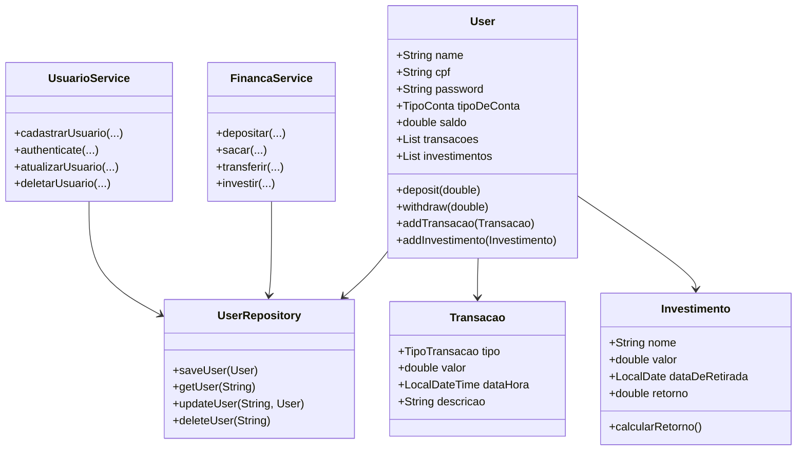

# MALDBANK

Criação do MALDBANK como projeto final da matéria de engenharia de Software

Sobre o Projeto

O **MALDBANK** é um sistema de simulação bancária robusto que permite o gerenciamento completo de usuários e suas respectivas contas. Desenvolvido inteiramente em Java, o sistema oferece operações financeiras fundamentais com suporte a múltiplos tipos de conta de forma polimórfica (como **Conta Corrente** e **Conta Poupança**).

### Principais Funcionalidades

* **Gestão de Usuários:** Fluxo de cadastro e autenticação simplificada via terminal.
* **Gestão de Contas:** Abertura e vinculação de contas dinâmicas com comportamento polimórfico.
* **Operações Financeiras:** * Consulta de saldo em tempo real
  * Realização de saques e depósitos
  * Transferências entre contas
  * Pagamento de contas/boletos
* **Histórico:** Emissão automatizada de extrato detalhado contendo todas as movimentações da conta ativa.

---

## Arquitetura do Sistema

Alinhado com os princípios de design de software modernos, o sistema foi projetado sob os pilares de **baixo acoplamento** e **alta coesão**. Por se tratar de um protótipo ágil, utiliza o padrão de **repositório em memória** (*In-Memory Repository*), garantindo a persistência temporária e o gerenciamento dos dados de forma segura durante o ciclo de vida da sessão atual.

## Fluxograma de interação:


## Processo de Software

Este projeto foi desenvolvido com uma abordagem ágil incremental, seguindo práticas de divisão de responsabilidades e entregas iterativas. O grupo repartiu as atividades entre:

- Modelagem e design de requisitos
- Implementação do fluxo de cadastro e autenticação
- Separação de serviços e repositórios
- Adição de histórico de transações e investimentos
- Testes unitários e ajustes de arquitetura

## Requisitos de Software

### Requisitos funcionais
- Cadastro de usuário com escolha do tipo de conta no momento da criação
- Autenticação por CPF e senha
- Atualização e exclusão de cadastro apenas após login
- Depósito, saque, transferência por CPF e visualização de saldo
- Histórico de movimentações completo (depósito, saque, PIX, investimento)
- Investimentos com cálculo simples de retorno e registro em extrato
- Menu subdividido em opções de cadastro e operações financeiras

### Requisitos não funcionais
- Implementação em Java com Gradle
- Arquitetura modular com camadas de Controller, Service, Repository e Model
- Persistência em memória para o protótipo
- Código com alta coesão e baixo acoplamento

## Modelo de Software

### Diagrama de fluxo



### Diagrama de classes



## Princípios e Propriedades de Projeto

O projeto aplica os princípios a seguir:

- Integridade conceitual: cada classe representa um elemento de domínio claro
- Coesão: `UsuarioService` trata apenas de cadastro e autenticação, `FinancaService` gerencia finanças
- Baixo acoplamento: serviços dependem de `UserRepository` por injeção no construtor
- Ocultação de informação: atributos privados com getters/setters controlados
- Princípios SOLID: separação de responsabilidades e injeção de dependência
- Preferência por composição: `User` compõe `Transacao` e `Investimento`
- Lei de Demeter: métodos operam sobre objetos próximos e evitam navegação profunda

## Testes de Software

O projeto utiliza JUnit para testes unitários. A dependência Mockito foi adicionada para suportar mocks em futuras validações de serviço contra dependências externas.

| Cobertura | Status |
| :--- | :--- |
| Testes de modelo de usuário | existente em `app/src/test/java` |
| Testes de contas e investimentos | existente em `app/src/test/java` |
| Suporte a mocks | dependência adicionada |

---

## Tecnologias e Metodologias

| Categoria | Tecnologias / Práticas |
| :--- | :--- |
| **Linguagem** | Java |
| **Metodologias** | Scrum, Kanban, XP |
| **Testes** | JUnit 5, Mockito |
| **Documentação** | Mermaid.js |

---

## Como Executar

Para rodar o projeto localmente, siga os passos abaixo:

1. **Clonar o repositório:**
   ```bash
   git clone [https://github.com/daviiq/MALDBANK](https://github.com/daviiq/MALDBANK)
   ```
   Pré-requisitos: Certifique-se de ter o JDK 17 ou superior instalado em sua máquina.

## Equipe de Desenvolvimento

Este projeto é um esforço colaborativo dos seguintes membros:

* **Adriel Alves Ferreira**
* **Davi Israel Quirino**
* **Marcos Júnior Lemes**
* **Lucas Luiz Guesser**

**Colaborador **
* *Monica Cancellier* 
