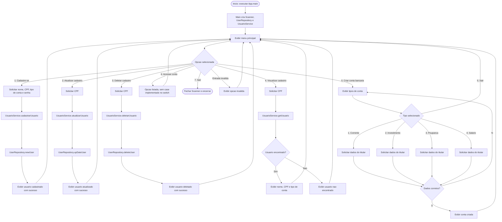
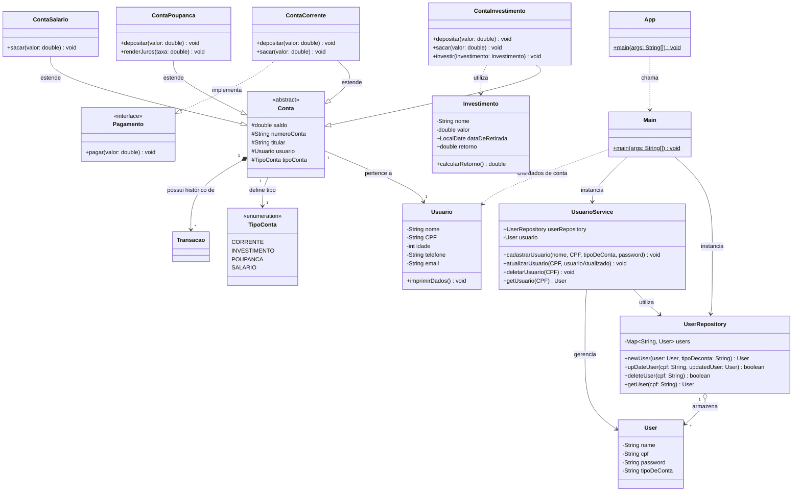
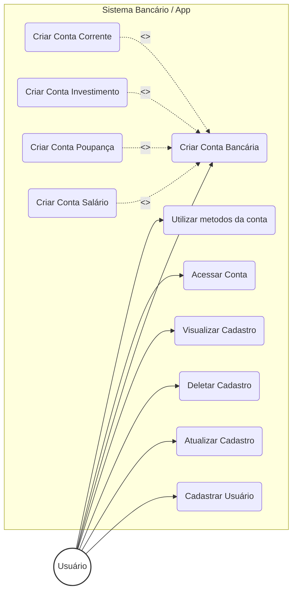

# MALDBANK

Criação do MALDBANK como projeto final da matéria de engenharia de Software

Sobre o Projeto

O **MALDBANK** é um sistema de simulação bancária robusto que permite o gerenciamento completo de usuários e suas respectivas contas. Desenvolvido inteiramente em Java, o sistema oferece operações financeiras fundamentais com suporte a múltiplos tipos de conta de forma polimórfica (como **Conta Corrente** e **Conta Poupança**).

### Principais Funcionalidades

* **Gestão de Usuários:** Fluxo de cadastro e autenticação simplificada via terminal.
* **Gestão de Contas:** Abertura e vinculação de contas dinâmicas com comportamento polimórfico.
* **Operações Financeiras:** * Consulta de saldo em tempo real
  * Realização de saques e depósitos
  * Transferências entre contas
  * Pagamento de contas/boletos
* **Histórico:** Emissão automatizada de extrato detalhado contendo todas as movimentações da conta ativa.

---

## Arquitetura do Sistema

Alinhado com os princípios de design de software modernos, o sistema foi projetado sob os pilares de **baixo acoplamento** e **alta coesão**. Por se tratar de um protótipo ágil, utiliza o padrão de **repositório em memória** (*In-Memory Repository*), garantindo a persistência temporária e o gerenciamento dos dados de forma segura durante o ciclo de vida da sessão atual.

## Fluxograma de interação:


## Diagrama de Classes:

## Diagrama de Casos de Uso:


## Tecnologias e Metodologias

| Categoria | Tecnologias / Práticas |
| :--- | :--- |
| **Linguagem** | Java |
| **Metodologias** | Scrum, Kanban, XP |
| **Testes** | JUnit 5, Mockito |
| **Documentação** | Mermaid.js |

---

## Como Executar

Para rodar o projeto localmente, siga os passos abaixo:

1. **Clonar o repositório:**
   ```bash
   git clone [https://github.com/daviiq/MALDBANK](https://github.com/daviiq/MALDBANK)
   ```
2. **Rodar o App**
   Pré-requisitos: Certifique-se de ter o JDK 17 ou superior instalado em sua máquina.

## Equipe de Desenvolvimento

Este projeto é um esforço colaborativo dos seguintes membros:

* **Adriel Alves Ferreira**
* **Davi Israel Quirino**
* **Marcos Júnior Lemes**
* **Lucas Luiz Guesser**

